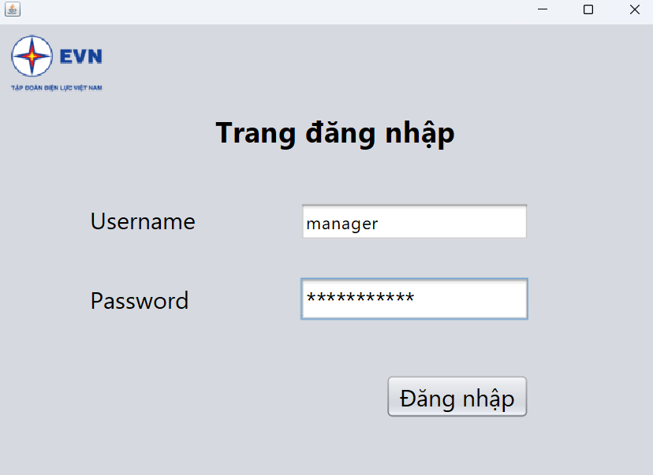
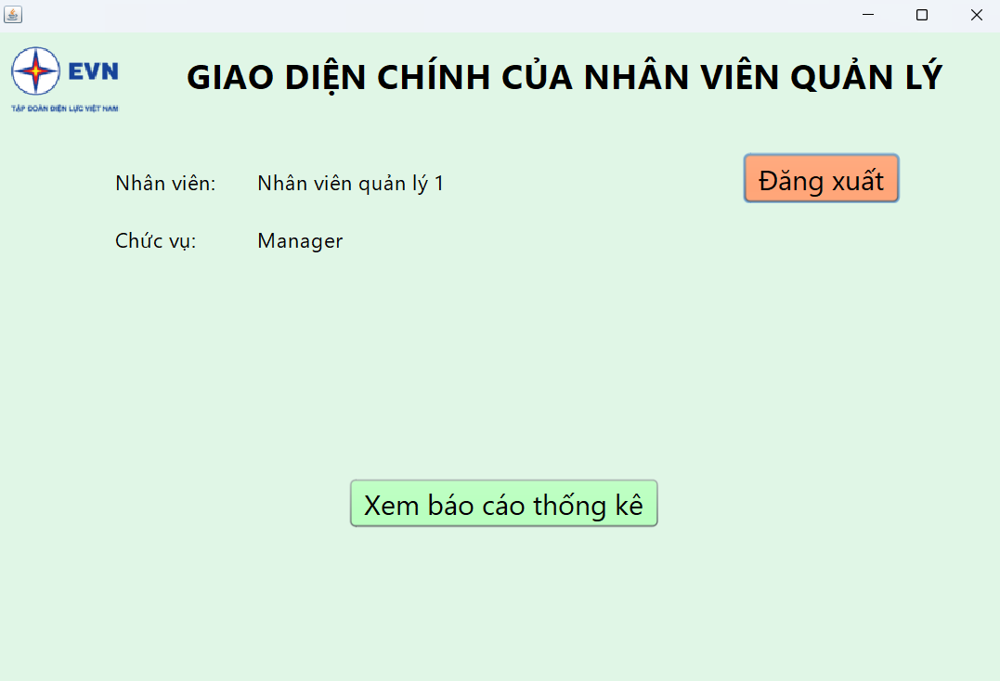
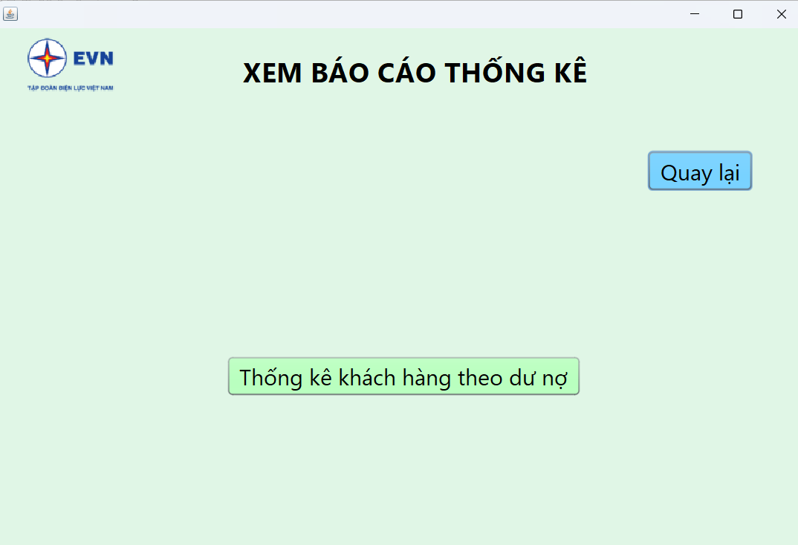
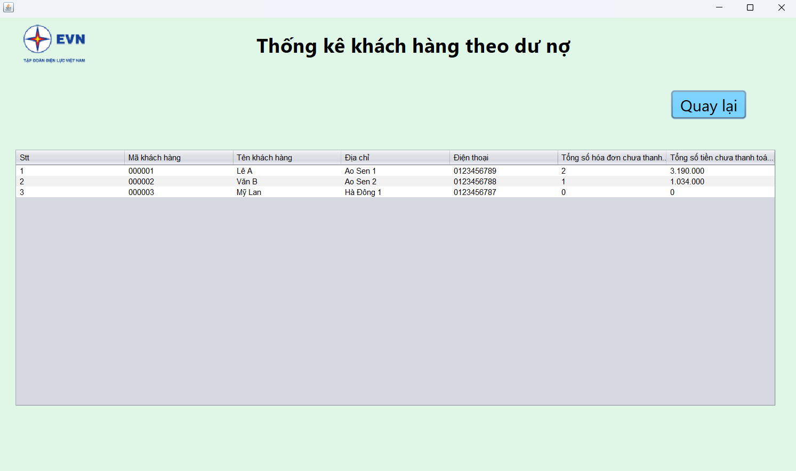
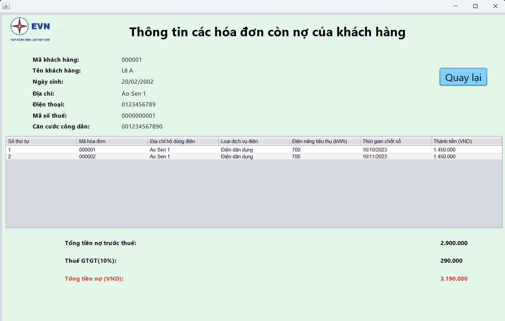
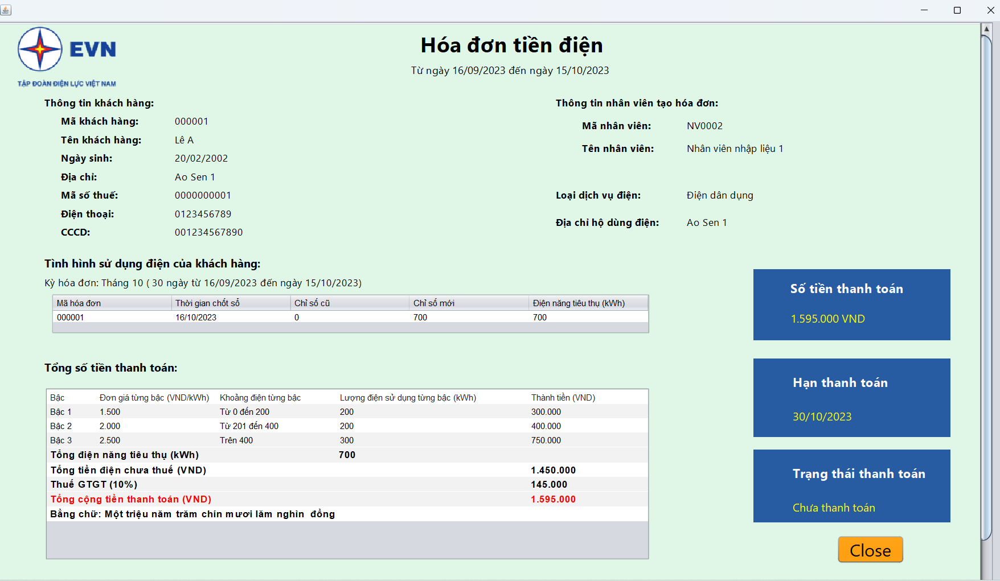

# CustomerStatisticsByOutstandingBalance

The "Customer Outstanding Debt Statistics" module is designed to provide comprehensive reports and analysis of customer outstanding debts. It helps manage and analyze the financial status of customers by aggregating and presenting information related to their outstanding balances. This module supports tracking the financial situation of customers and making informed decisions based on this data.

## Features

1. **Login Interface**
   - Allows users to log in to the system.
   - Requires username and password for access.

    

2. **Main Interface for Manager**
   - Provides access to various functions of the statistics module.
   - Includes options for viewing reports and performing debt analysis.

   

3. **Statistics Function Selection Interface**
   - Allows management staff to select different statistical functions.
   - Options include viewing and analyzing outstanding debt data.



4. **Customer Outstanding Debt Statistics Interface**
   - Displays statistics of customers based on their outstanding debts.
   - Provides a summary of debt levels for different customers.

   

5. **Outstanding Invoices for a Specific Customer**
   - Shows all outstanding invoices for a particular customer.
   - Lists details of each unpaid invoice.

   

6. **Detailed Invoice Information**
   - Provides detailed information about each outstanding invoice.
   - Includes invoice amounts, due dates, and other relevant details.

   

## Installation and Setup

1. **Clone the Repository:**
   ```bash
   git clone https://github.com/HungDuongXuan/CustomerStatisticsByOutstandingBalance/